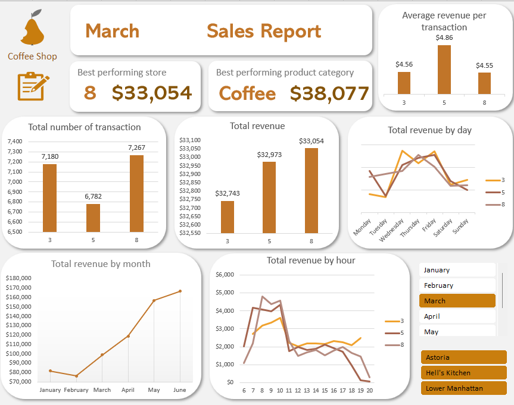

# ☕ Dynamic Coffee Shop Sales Dashboard – Excel

A comprehensive and interactive sales performance dashboard built using Microsoft Excel. This project is designed to transform raw sales data into actionable, real-time insights for multi-location coffee shop management.

## 📊 Dashboard Preview

---

## 🧩 Problem Statement

Design and develop a dynamic reporting solution in Excel aimed at providing **stakeholders** (management, operational staff) with **immediate, at-a-glance visibility** into core sales performance. The dashboard is specifically built to help users:

* **Identify Top Performers:** Quickly pinpoint the best-performing store locations and product categories by revenue.
* **Analyze Time-Based Trends:** Understand peak sales periods by day of the week and hour of the day to optimize staffing and resource allocation.
* **Track Monthly Progress:** Monitor total revenue and transaction volume trends across multiple months.
* **Interact with Data Dynamically:** Use simple slicers to filter performance by specific month or location.

---

## 🛠️ Tools & Features Used

* **Microsoft Excel:** For development and visualization.
* **Pivot Tables:** For aggregation and calculation of key metrics.
* **Slicers:** For dynamic, non-VBA based interactivity.
* **UX-focused Dashboard Design:** Alignment, color theory, and visual hierarchy.
* **Branding and Navigation Elements:** Company Logo and Hyperlinked Icons.

---

## ✅ Project Steps

### 1. Data Import and Preparation
Import sales data from a dedicated folder source, ensuring the dashboard can be automatically refreshed with new records. Clean and prepare data by formatting timestamps, verifying transaction IDs, and standardizing product details.

### 2. Metric Analysis & Pivot Tables
Build out analytical frameworks to separate key metrics:
* Total Revenue, Total Orders, and Average Bill amount.
* Sales distribution across locations (**Astoria**, **Lower Manhattan**, **Hell's Kitchen**).
* Product Category breakdowns (e.g., **Coffee**, **Tea**, **Bakery**).
* Hourly and daily transaction patterns.

### 3. Dashboard Interface Design
Develop a polished user interface utilizing custom theme colors (warm, coffee-inspired tones). Remove standard Excel gridlines and headers to give the spreadsheet a professional software application feel.

### 4. Visualization & Interactivity
Create custom Pivot Charts (Bar charts, Line charts, Area charts) tailored for easy scanning. Insert and link **Slicers** across all pivot elements to enable seamless, interactive filtering.

---

## 🎨 Design Philosophy & Layout

This dashboard follows professional business intelligence (BI) design practices:
* **KPI Summary Cards:** Placed at the very top for high-level executives to immediately grab vital statistics.
* **Z-Pattern Reading Flow:** Organized logically from left to right, top to bottom.
* **Consistent Color Palette:** Applied consistent use of colors to indicate specific store performance without visual clutter.
* **Clean Design:** A simplified layout to make complex data immediately understandable by non-technical stakeholders.

---

## 🚀 Usage and Data Refresh

To use this dynamic report:
1.  **Download:** Clone this repository or download the Excel file directly.
2.  **Open:** Open the file in Microsoft Excel (version 2013 or newer is recommended).
3.  **Navigate:** Go to the `Dashboard` sheet.
4.  **Interact:** Use the filter buttons (**Months** and **Locations**) on the right to dynamically update all charts and KPIs.
5.  **Data Refresh:** To update the report with new data, paste new sales transactions into the `Raw data` sheet, ensuring column headers match. Then, navigate to the **Data** tab in Excel and click **Refresh All**.

---

## 📊 Data Source and Attribution

The raw data used to generate this dashboard is sourced from a public dataset on Kaggle:
* **Dataset:** Coffee Shop Sales Analysis
* **Source:** Divu Saxena / Kaggle

### 🔗 Inspiration and Reference
The dashboard design principles, utilization of interactive Excel features (like Slicers and Pivot Charts), and layout planning were inspired by the following learning resource:
* **Video:** *Make an Awesome Excel Dashboard in Just 15 Minutes* (YouTube)

---

## 📄 License

This project is licensed under the MIT License - see the `LICENSE.md` file for details.

---

## 📬 Contact

If you have any questions, feedback, or collaboration ideas regarding this dashboard, feel free to reach out:

* **LinkedIn:** [Zoe Jhuang](https://www.linkedin.com/in/zoe-j-39599234a/)
* **Email:** zjhuang.gy@gmail.com
